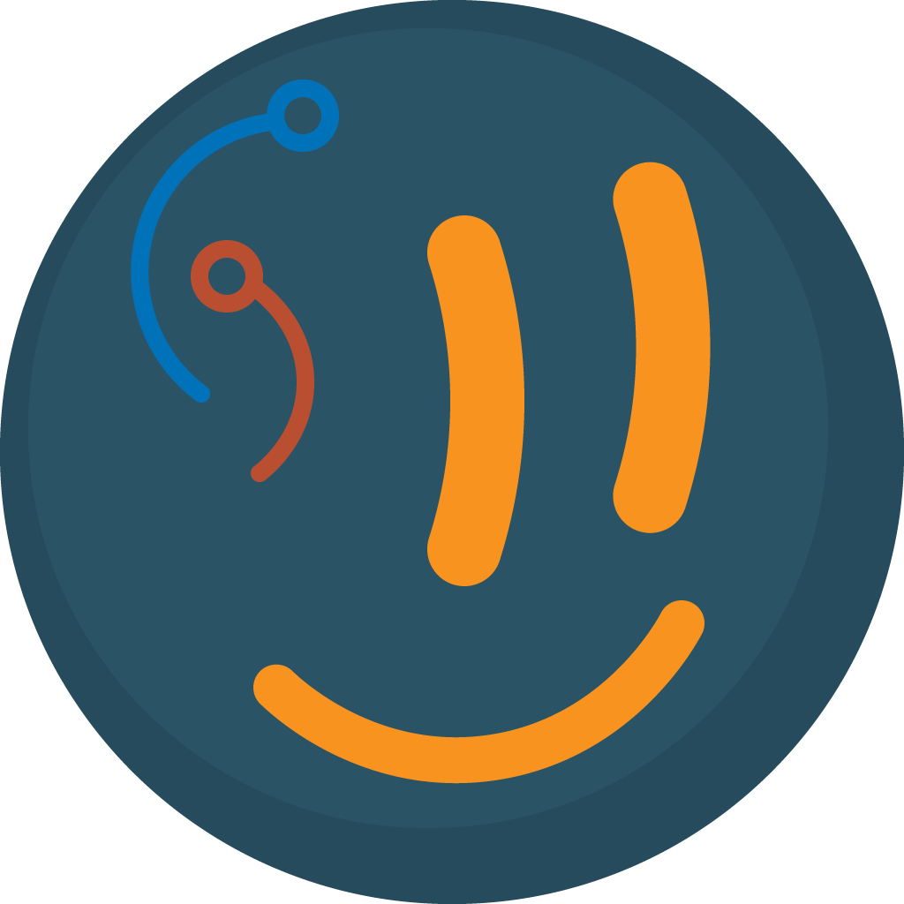

<div align="center">
  
</div>

# Norsk-bott

Norsk-bott is a Discord bot that provides various features for the Norwegian Language Learning community (NLL).

The bot is written in [TypeScript](https://www.typescriptlang.org/) and uses the [Discord.js](https://discord.js.org) library. [discord-nestjs](https://github.com/fjodor-rybakov/discord-nestjs) is used to provide a modular, dependency-injected architecture as a [NestJS](https://nestjs.com/) application.

## Contributing

Make sure you have [Node.js](https://nodejs.org/en/) and [Yarn](https://yarnpkg.com/) installed.

> [!TIP]
> It is recommended to use [Volta](https://volta.sh/) to manage Node.js versions. If Volta is installed, you do not need to do anything. When you run any commands in this repository, Volta will automatically install and install the correct versions of both Node.js and Yarn.

1. Clone the repository.
2. Run `yarn` to install dependencies.
3. Configure the environment variables by copying the `template.env` file to `.env` and filling in the values. See [Environment Variables](#environment-variables) for more information.
4. Run `yarn start:dev` to start the bot in development mode. The bot will now be running and you can make changes to the code. The bot will automatically restart when you save changes.

```sh
git clone https://github.com/nllcommunity/discord-norsk-bott.git
cd discord-norsk-bott

yarn
cp template.env .env
# Fill in the values in the .env file

yarn start:dev
```

## Environment Variables

The bot requires the following environment variables to be set.

### `DISCORD_TOKEN`

Required. The bot token from the [Discord Developer Portal](https://discord.com/developers/applications).

### `DEEPL_API_KEY`

Required. The API key from [DeepL](https://www.deepl.com/pro-api). Used for translation.

### `NOTION_TOKEN`

Optional. The integration token from [Notion](https://www.notion.so/my-integrations). Used for syncing content from Notion.

### `OPENAI_API_KEY`

Optional. The API key from [OpenAI](https://platform.openai.com/). Used to check random words pulled from the dictionary for appropriateness before sending them to the chat.

## Permissions

The bot requires the following permissions to function correctly.

```
https://discord.com/oauth2/authorize?client_id=<client_id>&permissions=397821422656&scope=bot+applications.commands
```

Replace `<client_id>` with the client ID of the bot.

### OAuth2 Scopes

- **`bot`** — Needed to join servers
- **`application.commands`** — Needed to register slash commands

### Bot Permissions

#### General Permissions

- **Manage Webhooks** — Used by the Notion sync feature to get webhook secrets
- **Read Messages/View Channels** — Required to translate messages

#### Text Permissions

- **Send Messages** — Required to send messages with translations or with Notion content
- **Create Public Threads** — Required to sync Notion content to threads
- **Create Private Threads** — Required to sync Notion content to threads
- **Send Messages in Threads** — Required to send messages with translations or with Notion content in threads
- **Manage Messages** — Required to delete old content from Notion, and to delete translation reactions
- **Manage Threads** — Required to delete old content from Notion
- **Read Message History** — Required to look up old messages synced from Notion
- **Add Reactions** — Required to add translation-complete reactions
- **Use Slash Commands** — Required to use slash commands

## Licence

[ISC](LICENCE)
